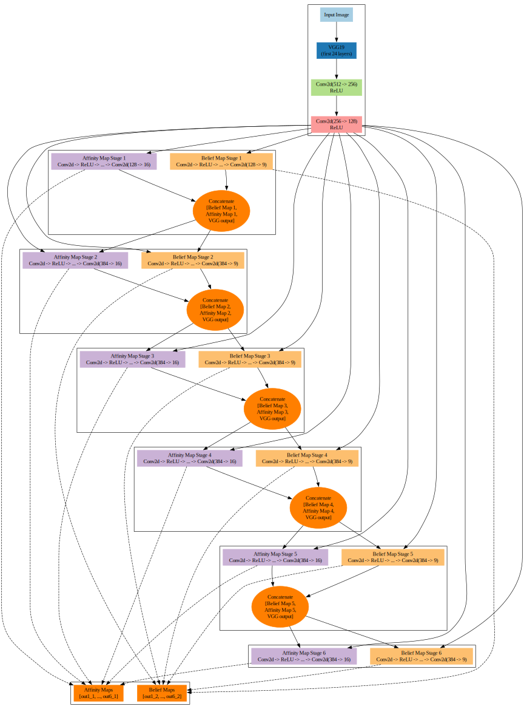

# Deep Object Pose Estimation (DOPE) - Modified Approach

This project contains a modified version of the Deep Object Pose Estimation (DOPE) algorithm designed to run on a single GPU. It includes the necessary scripts for data generation, training, inference, and evaluation.

## Project Structure

The project is organized into the following directories:

- **0_common/**: Contains common utilities and helper functions used across the project.
- **1_data_generation/**: Scripts and tools for generating synthetic training data using Blender.
- **2_training/**: Training scripts for training object pose estimation models using the generated data.
- **3_inference/**: Inference scripts to perform object pose estimation on new data using trained models.
- **4_evaluate/**: Evaluation scripts to assess the performance of the trained models using metrics such as ADD and KPD.
- **ros1/**: ROS 1 integration for real-time object pose estimation. This requires ROS 1 and is compatible with Ubuntu 20.04 Focal Fossa.
- **requirements.txt**: Python dependencies required for running the project.

## Prerequisites

### Python Environment

- Python 3.8 is required for running the scripts in this project.
- Install the required Python dependencies using the following command:

  ```bash
  pip install -r requirements.txt
  ```

### ROS 1

- For ROS 1 integration, Ubuntu 20.04 (Focal Fossa) is required, along with ROS Noetic Ninjemys.
- You can install ROS Noetic by following the official ROS installation guide [here](http://wiki.ros.org/noetic/Installation/Ubuntu) or the one in the ros1 folder.

## Getting Started
each folder has it's own readme:

1. **Data Generation**:
   - Go to the `1_data_generation/` folder and run the scripts to generate synthetic data for training.
  
2. **Training**:
   - Use the scripts in the `2_training/` folder to train object pose estimation models on the generated data.

3. **Inference**:
   - Perform inference on new images using the trained models by running the scripts in the `3_inference/` folder.

4. **Evaluation**:
   - Evaluate the performance of your models by running the scripts in the `4_evaluate/` folder.

5. **ROS 1 Integration**:
   - If you are using ROS 1 for real-time pose estimation, refer to the `ros1/` directory for ROS nodes and launch files.

## Acknowledgments

This project is a modified version of the original DOPE approach, with enhancements and modifications for single GPU support and additional functionalities for real-time applications.

## Architecture

Below is the architecture of the DOPE approach:

